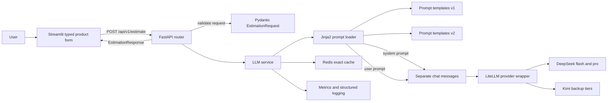
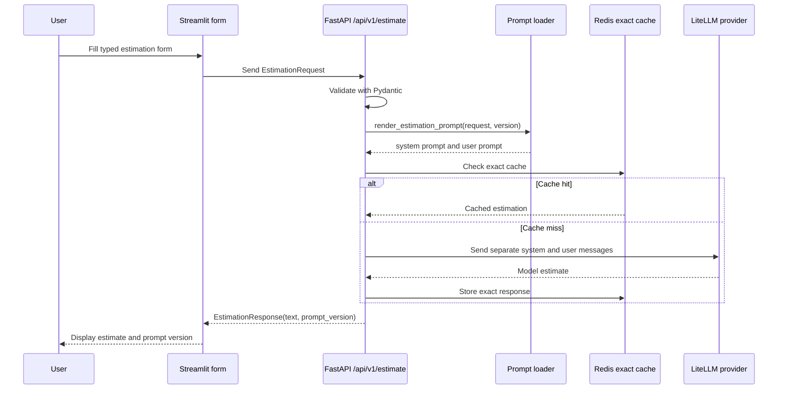

# AI Engineering Coursework

This repository contains LIDR AI Engineering coursework.

## Review this for pre Session 04

The current submission is here:

```text
estimador-cag/
```

Current branch:

```text
gg-pre-session-04-product-interface
```

Latest known commit after optional cleanup:

```text
a424daf feat: add optional prompt versioning and reference projects
```

The folder `estimator/` is an older or separate project folder. It is not the pre Session 04 submission target.

## Repository map

```text
.
├── estimador-cag/      Active Session 03 and pre Session 04 estimator project
├── estimator/          Older or separate estimator project, not the current submission
├── docs/               Audits, handoffs, comparisons, and notes
├── scripts/            Helper scripts
├── docker-compose.yml  Root compose file used by some workflows
└── README.md           This review guide
```

## What the current submission implements

The active project converts the estimator from a free chat interface into a typed product interface.

Mandatory pre Session 04 scope:

* Streamlit uses a typed `st.form` instead of chat input.
* The backend accepts a typed `EstimationRequest`.
* The prompt moved from Python strings into versioned Jinja2 templates.
* The prompt loader renders separate system and user prompts.
* The provider receives separate `system` and `user` messages.
* The typed response returns `text` and `prompt_version`.
* Template tests are included.
* README run and test instructions exist inside `estimador-cag/README.md`.

Allowed optional extras already completed:

* Prompt version `v2`.
* Query parameter `?prompt_version=v2`.
* Optional `reference_projects`.
* Prompt render hash logging.
* Cleaner typed validation errors.

Explicitly not implemented because the exercise reserved them for live session:

* Structured JSON output.
* Guardrails.
* Semantic cache.

## Architecture



## Request workflow



## Active prompt layout

```text
estimador-cag/app/prompts/
├── loader.py
└── estimation/
    ├── v1/
    │   ├── system.j2
    │   ├── user.j2
    │   └── examples.j2
    └── v2/
        ├── system.j2
        ├── user.j2
        └── examples.j2
```

## Run the active project

```bash
cd /workspaces/ai-engineering/estimador-cag

docker compose up -d redis

uv run uvicorn app.main:app --host 0.0.0.0 --port 8000
```

In another terminal:

```bash
cd /workspaces/ai-engineering/estimador-cag

uv run streamlit run streamlit_app.py --server.address 0.0.0.0 --server.port 8501
```

In Codespaces, use these ports:

```text
8000 FastAPI
8501 Streamlit
```

## Test the active project

```bash
cd /workspaces/ai-engineering/estimador-cag

uv run ruff check app/ tests/ streamlit_app.py
uv run pytest tests/ -v
uv run python -m py_compile \
  app/main.py \
  app/config.py \
  app/services/llm_service.py \
  app/services/provider.py \
  app/services/cache.py \
  app/services/costs.py \
  app/services/conversation.py \
  app/services/litellm_provider.py \
  app/middleware/logging.py \
  app/routers/estimations.py \
  app/schemas/estimation.py \
  app/prompts/loader.py \
  streamlit_app.py
```

Latest known full gate:

```text
106 passed
```

## Sample typed request

```bash
curl -sS -X POST 'http://localhost:8000/api/v1/estimate?prompt_version=v2' \
  -H "Content-Type: application/json" \
  -d '{ 
    "description": "Build a B2B onboarding SaaS with account approval, role based admin review, email notifications, and an operations reporting dashboard.",
    "project_type": "web_saas",
    "detail_level": "medium",
    "output_format": "phases_table",
    "reference_projects": [
      {
        "name": "CRM migration",
        "summary": "Moved spreadsheet workflows to a role based SaaS.",
        "estimated_hours": 260,
        "notes": "Permissions and reporting were the main risks."
      }
    ]
  }'
```

Expected response shape:

```json
{
  "text": "...",
  "prompt_version": "v2"
}
```

## Submission link

```text
https://github.com/herman-aukera/ai-engineering/tree/gg-pre-session-04-product-interface
```
